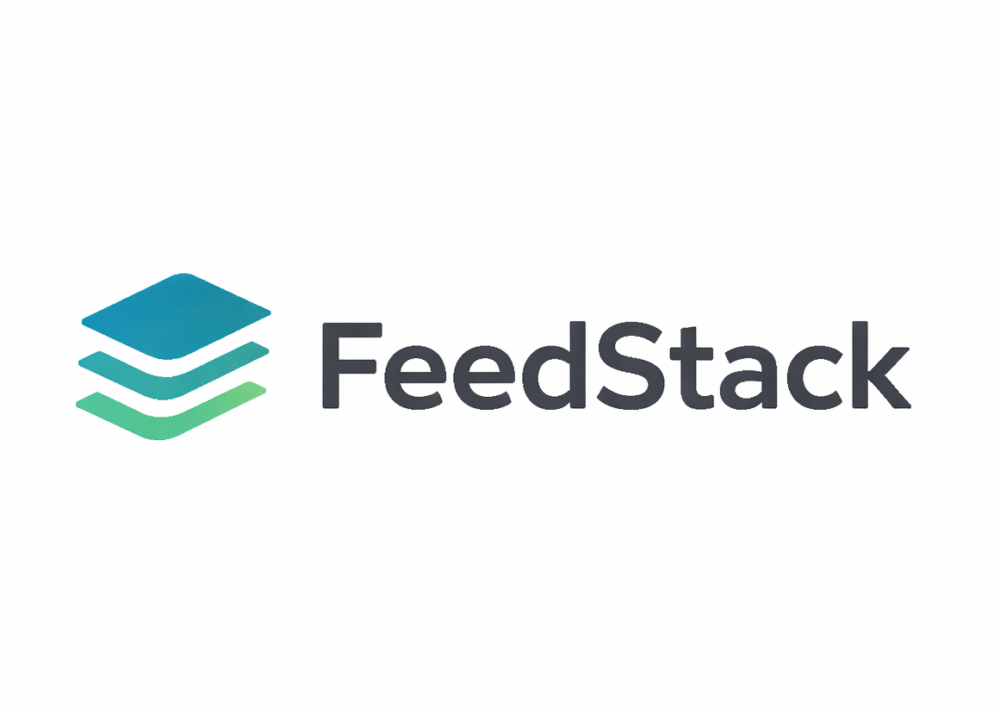
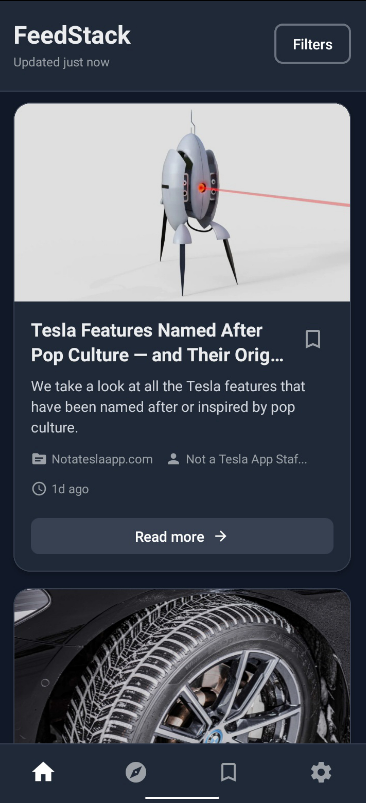

<div align="center">



# FeedStack

**A lightweight, opinionated RSS & article reader built for speed and simplicity.**

[](https://expo.dev)
[](https://reactnative.dev)
[](https://www.typescriptlang.org)
[](LICENSE)

</div>

<br />

## 📖 About

**FeedStack** is a modern, open-source feed reader tailored for developers and power users who value a distraction-free reading experience. Built with **Expo** and the latest **React Native** capabilities, it features a clean UI, robust offline caching, and seamless cross-platform performance (iOS, Android, Web).

Unlike bloated aggregators, FeedStack keeps it simple: discover, read, and save what matters.

## ✨ Features

- **📱 Cross-Platform**: Optimized for Android, iOS, and Web using Expo.
- **📰 Smart Discovery**: Browse curated articles and trending feeds.
- **⚡ Offline First**: Intelligent caching layer for reading on the go.
- **🔖 Bookmarks**: Save articles locally for later access.
- **🎨 Modern UI**: Clean aesthetics with Dark/Light mode support.
- **🔔 Notifications**: (Coming Soon) Stay updated with breaking news.

## 📸 Screenshots





## Tech Stack

- **Core**: [React Native](https://reactnative.dev/), [Expo](https://expo.dev/), [TypeScript](https://www.typescriptlang.org/)
- **Routing**: [Expo Router](https://docs.expo.dev/router/introduction/) (File-based routing)
- **State/Cache**: Context API + Custom Caching Service
- **Persistence**: `AsyncStorage`
- **Network**: `Axios`
- **API**: [NewsAPI](https://newsapi.org/)

## 📂 Project Structure

We follow a clean, opinionated `src/` directory structure to keep the codebase scalable.

```text
/
├── src/
│   ├── api/             # API clients and endpoints (NewsAPI, etc.)
│   ├── app/             # Expo Router screens (file-based routing)
│   ├── components/      # Reusable UI components
│   ├── constants/       # App-wide constants (Colors, Config)
│   ├── hooks/           # Custom React hooks
│   ├── services/        # Core business logic (Storage, Cache, Notifications)
│   └── types/           # Global TypeScript definitions
├── assets/              # Images, fonts, and static resources
└── package.json         # Dependencies and scripts
```

## 🚀 Getting Started

Follow these steps to get the app running locally.

### Prerequisites

- **Node.js** (LTS version recommended)
- **npm** or **yarn**
- **Expo Go** app on your physical device OR Android Studio / Xcode for simulators.

### Installation

1. **Clone the repository:**

    ```bash
    git clone https://github.com/0xZayyad/feedstack.git
    cd feedstack
    ```

2. **Install dependencies:**

    ```bash
    npm install
    ```

3. **Configure Environment Variables:**
    Create a `.env` file in the root directory:

    ```bash
    touch .env
    ```

    Add your NewsAPI key (get one [here](https://newsapi.org/)):

    ```env
    EXPO_PUBLIC_NEWS_API_KEY=your_api_key_here
    ```

### Running the App

Start the development server:

```bash
npm start
```

- Press `a` to open on Android Emulator.
- Press `i` to open on iOS Simulator.
- Press `w` to run in the browser.
- Scan the QR code with **Expo Go** to run on a physical device.

## 🤝 Contributing

Contributions are what make the open-source community an amazing place to learn, inspire, and create. Any contributions you make are **greatly appreciated**.

1. Fork the Project
2. Create your Feature Branch (`git checkout -b feat/AmazingFeature`)
3. Commit your Changes (`git commit -m 'Add some AmazingFeature'`)
4. Push to the Branch (`git push origin feat/AmazingFeature`)
5. Open a Pull Request

## 📄 License

Distributed under the MIT License. See `LICENSE` for more information.

## 📬 Contact

**0xZayyad** - [GitHub](https://github.com/0xZayyad)

Project Link: [https://github.com/0xZayyad/feedstack](https://github.com/0xZayyad/feedstack)
